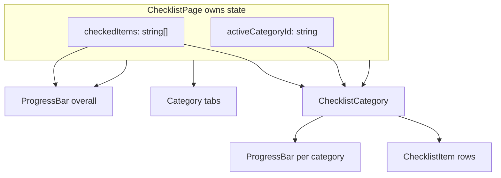

# Phase 1 Static Checklist UI

## Current state

The repo is a **file scaffold**: all six target files exist but contain only a one-line comment stub. [`src/data/checklistData.js`](src/data/checklistData.js) is also empty. There is no `package.json`, `index.html`, `main.jsx`, or `App.jsx`, so the dev server cannot run yet.

You chose to include **full bootstrap** so each step can be tested in the browser.

## Teaching approach (every file)

Per your rules and the [react-dev skill](.cursor/skills/react-dev/SKILL.md), each file will follow this rhythm:

1. **What we're building and why** — plain language, no jargon assumed
2. **Code** — functional component, `const` + arrow functions, Tailwind `className`, section comments
3. **How props/state flow** — who owns data, what gets passed down
4. **How to test** — specific browser checks before moving on



---

## Step 0 — Prerequisites (before the 6 files)

### 0a. Vite + React + Tailwind v4 bootstrap

Create the minimum files so `npm run dev` works (patterns from [vite-docs](.cursor/skills/vite-docs/SKILL.md) and [tailwind-docs](.cursor/skills/tailwind-docs/SKILL.md)):

| File | Purpose |
|------|---------|
| `package.json` | `react`, `react-dom`, `react-router-dom`, `vite`, `@vitejs/plugin-react`, `tailwindcss`, `@tailwindcss/vite` |
| `vite.config.js` | React + Tailwind plugins |
| `index.html` | Root entry with `#root` and `/src/main.jsx` |
| `src/main.jsx` | Mount React, import `src/index.css` |
| `src/index.css` | `@import "tailwindcss";` |
| `src/App.jsx` | `BrowserRouter` + single route `/checklist` → `ChecklistPage` (temporary for Phase 1 testing) |

**Why:** Without this shell, Steps 1–5 have nowhere to render and Step 6 cannot be opened in the browser.

### 0b. Populate [`src/data/checklistData.js`](src/data/checklistData.js)

Export a `checklistData` array of **3 categories** with **2 items each** (6 total — matches the ProgressBar example “4 of 6 done”):

```js
// Shape per category
{ id, name, description, items: [...] }

// Shape per item (matches your spec + README ER diagram)
{ id, title, description, fixTip, weight }
```

Suggested categories: **On-Page SEO**, **Technical SEO**, **Content SEO**. Each item gets a unique `id` (e.g. `onpage-title-tag`) and a `weight` (e.g. 10–20) for later scoring—**not used in Phase 1 UI**, but keeps data ready for Phase 2.

**Why:** [`ChecklistPage.jsx`](src/pages/ChecklistPage.jsx) imports this file in Step 6; tabs and progress math depend on it.

---

## Step 1 — [`src/components/ui/Button.jsx`](src/components/ui/Button.jsx)

**What:** A reusable `<button>` so every action in the app looks consistent.

**Why:** UI primitives live in `src/components/ui/` per project rules; parents pass behavior via props instead of duplicating Tailwind strings.

**Implementation:**

- Props: `children`, `onClick`, `variant` (`"primary"` | `"outline"`), optional `className`, spread `...props` for `disabled`, `type`, etc.
- `primary`: filled accent (`bg-blue-600 text-white hover:bg-blue-700`)
- `outline`: border only (`border-2 border-blue-600 text-blue-600 bg-transparent hover:bg-blue-50`)
- Shared base classes: `rounded-lg px-4 py-2 font-medium transition-colors focus:ring-2` (keyboard accessible)

**Test:** Temporarily add two buttons at the top of [`ChecklistPage.jsx`](src/pages/ChecklistPage.jsx) (`primary` + `outline`) with `onClick={() => alert('clicked')}`. Confirm both styles and click handlers work.

---

## Step 2 — [`src/components/ui/Badge.jsx`](src/components/ui/Badge.jsx)

**What:** A small pill label for status/category tags (used later on Results/Fix Tips; built now as a shared primitive).

**Why:** Centralizes color mapping so `"green" | "orange" | "red"` always renders the same Tailwind combo.

**Implementation:**

- Props: `children`, `color` (`"green"` | `"orange"` | `"red"`)
- Map to Tailwind: `bg-*-100 text-*-800` + `rounded-full px-2.5 py-0.5 text-xs font-medium`
- Default to `green` if missing

**Test:** Add three badges beside the test buttons on `ChecklistPage`. Verify pill shape and colors on mobile width (DevTools responsive mode).

---

## Step 3 — [`src/components/checklist/ChecklistItem.jsx`](src/components/checklist/ChecklistItem.jsx)

**What:** One checklist row with a checkbox, title, and green highlight when checked.

**Why:** Keeps each row dumb/presentational—parent owns whether it’s checked; this component only displays and reports clicks.

**Props:** `item`, `isChecked`, `onToggle`

**Implementation:**

- Outer `<div>` is clickable: `onClick={onToggle}` + `cursor-pointer`
- Conditional classes: checked → `bg-green-50 border-green-200`; unchecked → `bg-white border-slate-200`
- Inner `<input type="checkbox">` with `checked={isChecked}` and `onChange={onToggle}`; `onClick={(e) => e.stopPropagation()}` on checkbox optional (both paths call same handler—either is fine)
- Show `item.title` only in Phase 1 (description/fixTip saved for later phases)
- Mobile: `p-4`, `min-h-[44px]` touch target, `w-full`

**Test:** Hard-code one `ChecklistItem` on `ChecklistPage` with local `useState` for that single item. Click row and checkbox; background should toggle green.

---

## Step 4 — [`src/components/checklist/ProgressBar.jsx`](src/components/checklist/ProgressBar.jsx)

**What:** Visual bar + text showing completion fraction.

**Why:** Reused at page level (all categories) and category level (subset)—one component, two call sites.

**Props:** `completed`, `total`

**Implementation:**

- Derive `percentage = total === 0 ? 0 : Math.round((completed / total) * 100)` (avoid divide-by-zero)
- Gray track: `bg-slate-200 rounded-full h-3 w-full`
- Filled inner bar: `bg-blue-600 h-3 rounded-full` with `style={{ width: `${percentage}%` }}`
- Label: `{completed} of {total} done` (`text-sm text-slate-600`)
- Add `role="progressbar"` + `aria-valuenow/min/max` for accessibility

**Test:** Render with `completed={4} total={6}` — bar ~67%, text “4 of 6 done”. Try `0/6` and `6/6`.

---

## Step 5 — [`src/components/checklist/ChecklistCategory.jsx`](src/components/checklist/ChecklistCategory.jsx)

**What:** Section wrapper: heading, description, category progress, list of items.

**Why:** Groups related `ChecklistItem` rows so `ChecklistPage` stays small—page handles tabs/state; category handles layout.

**Props:** `category`, `checkedItems`, `onToggleItem`

**Implementation:**

- Heading: `category.name` (`text-xl font-semibold`)
- Subtext: `category.description` (`text-slate-600`)
- Count checked in this category: `category.items.filter(item => checkedItems.includes(item.id)).length`
- `<ProgressBar completed={...} total={category.items.length} />`
- Map `category.items` → `<ChecklistItem key={item.id} item={item} isChecked={checkedItems.includes(item.id)} onToggle={() => onToggleItem(item.id)} />`

**State flow:** Does **not** own checked state—receives `checkedItems` from parent and calls `onToggleItem(id)` upward.

**Test:** Pass one category from `checklistData` + parent `useState` for `checkedItems`. Tick items; category bar updates independently of other categories.

---

## Step 6 — [`src/components/checklist/ChecklistPage.jsx`](src/pages/ChecklistPage.jsx)

**What:** Main checklist screen—tabs, overall progress, active category.

**Why:** This is the **state owner** (lifting state up per react.dev)—only here do we `useState` for checks and active tab.

**Implementation:**

```js
import { useState } from 'react';
import checklistData from '../data/checklistData';
```

**State:**

- `checkedItems` — `useState([])` array of item id strings
- `activeCategoryId` — `useState(checklistData[0].id)`

**Handlers:**

```js
const handleToggleItem = (itemId) => {
  setCheckedItems((prev) =>
    prev.includes(itemId)
      ? prev.filter((id) => id !== itemId)
      : [...prev, itemId]
  );
};
```

**Derived values:**

- `allItems` — flatten `checklistData.flatMap(c => c.items)`
- `overallCompleted` — count ids in `checkedItems` that exist in `allItems`
- `activeCategory` — `checklistData.find(c => c.id === activeCategoryId)`

**Layout (mobile-first):**

- Page title + overall `<ProgressBar />`
- Tab row: map `checklistData` → buttons; active tab gets `border-b-2 border-blue-600 font-semibold`; `onClick` sets `activeCategoryId`
- Render one `<ChecklistCategory />` for `activeCategory`
- Container: `max-w-3xl mx-auto px-4 py-6`

**Remove** temporary Button/Badge test markup from earlier steps.

**Test checklist (full Phase 1):**

1. `npm install` then `npm run dev` → open `/checklist`
2. Overall bar shows `0 of 6 done`; tick items in one tab; overall count updates even when another tab is selected
3. Switch tabs — checked items stay checked when you return
4. Category bar reflects only that category’s items
5. Click anywhere on a row toggles check
6. Resize to phone width — tabs wrap or scroll; rows remain tappable

---

## Files touched (summary)

| Order | File | Action |
|-------|------|--------|
| 0 | Bootstrap files + `checklistData.js` | Create / populate |
| 1 | `Button.jsx` | Implement |
| 2 | `Badge.jsx` | Implement |
| 3 | `ChecklistItem.jsx` | Implement |
| 4 | `ProgressBar.jsx` | Implement |
| 5 | `ChecklistCategory.jsx` | Implement |
| 6 | `ChecklistPage.jsx` | Implement + remove temp test UI |

**Out of scope for Phase 1:** Firebase, `useChecklist` hook, score calculation, fix-tip pages, Navbar/Footer wiring, persisting checks beyond React state.

---

## Execution order when you approve

We will implement **one file at a time**, pausing after each with the full beginner explanation (concept → code → line walkthrough → test instructions) before continuing to the next file.
